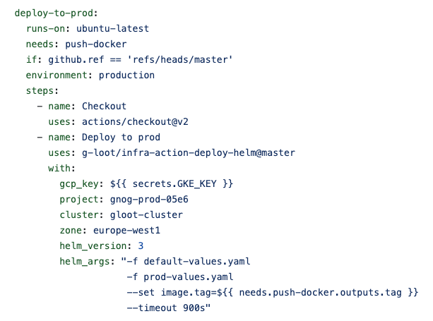

# action-deploy-helm

This repository contains an action for deploying Helm charts to a Kubernetes cluster using GitHub Actions. The action provides an automated way to deploy your applications or infrastructure using Helm charts, reducing the manual effort required for deployment.

## Usage

